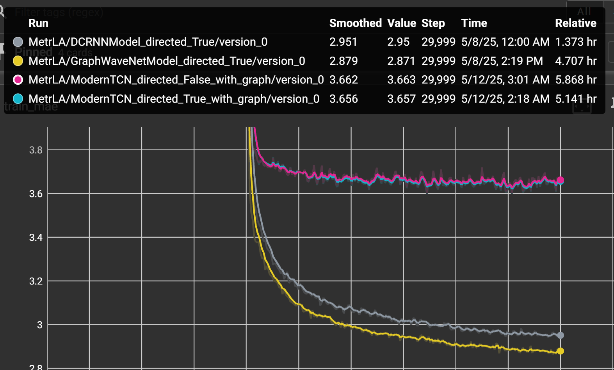

# Non-convolutional simplicial complex spatiotemporal analysis

## Installation

Install required dependencies:
```bash
pip install -r requirements.txt
```

## Run code

```bash
python run.py
```


## Experiment results
<table>
  <tr>
    <th>Model</th>
    <th colspan="2" align="center">Metr LA</th>
    <th colspan="2" align="center">AirQuality 36</th>
      <th colspan="2" align="center">AirQuality Full</th>
  </tr>
  <tr>
    <th></th>
    <th>MAE</th>
    <th>MSE</th>
    <th>MAE</th>
    <th>MSE</th>
    <th>MAE</th>
    <th>MSE</th>
  </tr>
  <tr>
    <td>DCRNN Directed</td>
    <td>3.18</td>
    <td>39.67</td>
    <td>-</td>
    <td>-</td>
    <td>-</td>
    <td>-</td>
  </tr>
    <tr>
    <td>DCRNN Undirected</td>
    <td>3.27</td>
    <td>42.04</td>
    <td>31.96</td>
    <td>2593.73</td>
    <td>21.21</td>
    <td>1414.68</td>
  </tr>
  <tr>
    <td>Graph Wavenet Directed</td>
    <td>3.16</td>
    <td>38.88</td>
    <td>-</td>
    <td>-</td>
    <td>-</td>
    <td>-</td>
  </tr>
    <tr>
    <td>Graph Wavenet undirected</td>
    <td>3.24</td>
    <td>41.09</td>
    <td>30.63</td>
    <td>2344.78</td>
    <td>21.07</td>
    <td>1380.89</td>
  </tr>
  <tr>
    <td>Ours</td>
    <td>3.83</td>
    <td>59.78</td>
    <td>33.12</td>
    <td>2699.32</td>
    <td>23.12</td>
    <td>1558.18</td>
  </tr>
</table>


## Experiment results with Graph Structure
<table>
  <tr>
    <th>Model</th>
    <th colspan="2" align="center">Metr LA</th>
  </tr>
  <tr>
    <th></th>
    <th>MAE</th>
    <th>MSE</th>
  </tr>
  <tr>
    <td>Ours(Nodes + Edges)</td>
    <td>3.89</td>
    <td>60.91</td>
  </tr>
  <tr>
    <td>Ours(Directed Graph)</td>
    <td>3.81</td>
    <td>59.16</td>
  </tr>
  <tr>
    <td>Ours(Undirected Graph)</td>
    <td>3.82</td>
    <td>59.66</td>
  </tr>
</table>

<figure>
  
  <figcaption>Training Learning curve</figcaption>
</figure>
